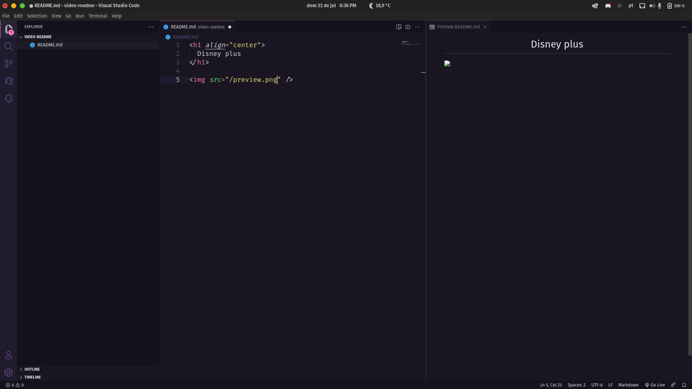

<h1 align="center">
  Nome do repositório
</h1>



## 💻 Projeto

Descrição do projeto(funcionalidade principal, link figma, link autor, outras informações)

## 🚀 Tecnologias

- [React](https://pt-br.reactjs.org/)
- [Styled Components](https://styled-components.com/)
- [SVG Injesct](https://github.com/iconfu/svg-inject)

## 📔 Conhecimentos abordados

- [x] Regra de negócio 1
- [x] Regra de negócio 2
- [] Deploy da aplicação no local X

## 📥 Instalação e execução

Faça um clone desse repositório e acesse o diretório.

```bash
$ git clone git@github.com..... && cd nome_da_pasta

# Instalando as dependências
$ yarn
```

Configure as variáveis de ambiente seguindo o arquivo `.env.example`

```bash
# Executanto aplicação
$ yarn dev
```

Executando os testes unitários e sua cobertura

```bash
# Executanto os testes
$ yarn test --coverage
```